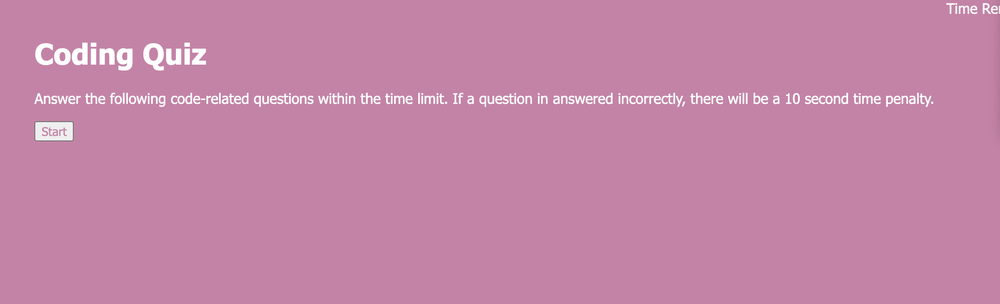

# Coding-quiz

## Description

This project was created as a coding quiz to utilize the knowledge we have learned about JavaScript and create a quiz based in that. This was build to test the users knowledge in coding and keep a log of the scores that were recieved. This can be used to test a class on some basic knowledge of coding. I learned how to properly create funcations in JavaScript and create a simple quiz that saves the users scores in local storage and on the website.

## Installation

N/A

## Usage

## Credits

Tutoring from TA Ian Von Fange and Phillip Loy

https://gamedevjs.com/articles/using-local-storage-for-high-scores-and-game-progress/

## License

MIT License

Copyright (c) 2024 aejantz2015

Permission is hereby granted, free of charge, to any person obtaining a copy
of this software and associated documentation files (the "Software"), to deal
in the Software without restriction, including without limitation the rights
to use, copy, modify, merge, publish, distribute, sublicense, and/or sell
copies of the Software, and to permit persons to whom the Software is
furnished to do so, subject to the following conditions:

The above copyright notice and this permission notice shall be included in all
copies or substantial portions of the Software.

THE SOFTWARE IS PROVIDED "AS IS", WITHOUT WARRANTY OF ANY KIND, EXPRESS OR
IMPLIED, INCLUDING BUT NOT LIMITED TO THE WARRANTIES OF MERCHANTABILITY,
FITNESS FOR A PARTICULAR PURPOSE AND NONINFRINGEMENT. IN NO EVENT SHALL THE
AUTHORS OR COPYRIGHT HOLDERS BE LIABLE FOR ANY CLAIM, DAMAGES OR OTHER
LIABILITY, WHETHER IN AN ACTION OF CONTRACT, TORT OR OTHERWISE, ARISING FROM,
OUT OF OR IN CONNECTION WITH THE SOFTWARE OR THE USE OR OTHER DEALINGS IN THE
SOFTWARE.